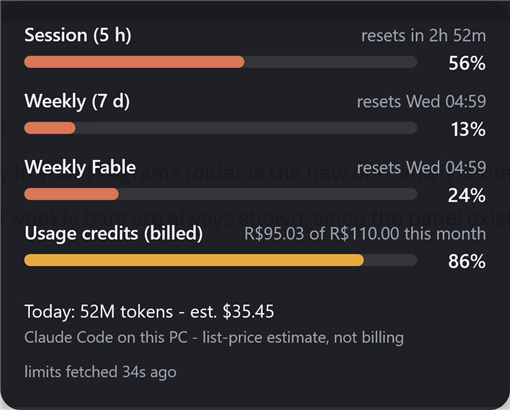
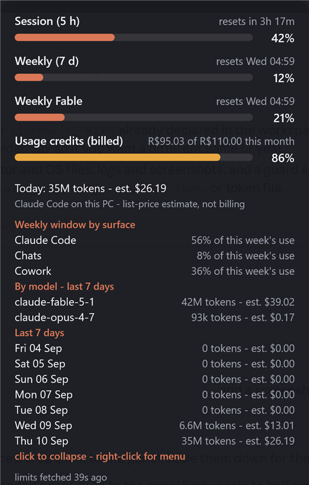
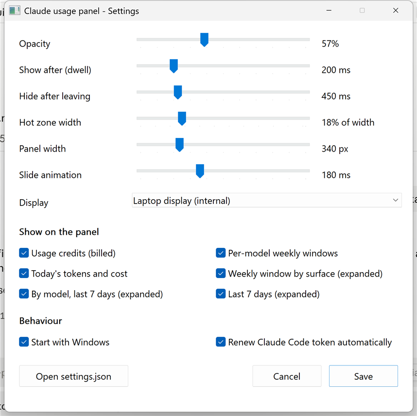

# Claude usage panel

A hidden panel that slides down from the top-center of the laptop display when
the mouse dwells there, showing how much of your Claude subscription limits is
used and what Claude Code has consumed today. Windows 11, Rust, no runtime to
install.

**Costs shown anywhere in this project are estimates at Anthropic list price,
computed from local token counts. They are not billing data.** The one
exception is the "Usage credits (billed)" row, which the account reports
directly.

<p align="center">
  
  &nbsp;&nbsp;
  
</p>

Left: the face that slides down on hover. Right: after a click. The panel is
slightly translucent, which is why the desktop shows through.

## What it shows

Collapsed face (a glance, not a dashboard):

- **Session (5 h)** and **Weekly (7 d)** - percentage of the subscription window
  used and when it resets. These are account-wide: the same windows claude.ai
  chat, Cowork and Claude Code all draw from.
- **Today** - tokens and estimated cost from Claude Code transcripts on this PC.
  Chat and Cowork usage never appears here because it is not stored locally.
- A footer saying how old the limit reading is. Stale readings are drawn grey;
  a window whose reset time has passed shows "window reset - no newer reading"
  instead of a number. The panel never displays a guessed percentage.

Click the panel to expand: every other limit the account reports (Opus/Sonnet
weekly, usage credits, spend limit), tokens and estimated cost per model, and
the last 7 days. Click again to collapse. Right-click for Refresh / Open
settings / Open log / Quit.

## Where the data comes from

| Data | Source | Notes |
|---|---|---|
| Limit windows | `GET https://api.anthropic.com/api/oauth/usage` with your OAuth token | **Unsupported.** This is the call Claude Code's own `/usage` makes; it is not publicly documented and may change without notice. The panel polls it at most once per `limits_min_gap_secs`. |
| Token counts, per-model, per-day | `~/.claude/projects/**/*.jsonl` (Claude Code transcripts) | Read incrementally; only appended bytes are re-read. One API response is written as several records sharing `message.id`; the last one wins. |
| Prices | `crates/usage-core/pricing.json` | Copied from the official pricing page on the date in the file. Update by hand when prices change. |

### The OAuth token

The usage endpoint requires the `user:profile` scope. Tokens from
`claude setup-token` do not have it (verified: HTTP 403), so the only usable
token is Claude Code's own session token in `~/.claude/.credentials.json`.
That token expires about every 8 hours, and Claude Code renews it only while a
terminal session is making requests.

To stay live without a terminal open, the panel renews it itself
(`auto_refresh_token`, on by default): when the stored token has expired, it
posts the refresh token to the token endpoint Claude Code uses, then writes the
new pair back to the credentials file atomically, keeping every other field.
This is the same thing the third-party tray apps do. Caveats:

- Unsupported flow. The endpoint URL was read from the Claude Code binary; the
  request shape and the client id (`oauth_client_id`) are what third-party tools
  use and are confirmed only by the server accepting them.
- If a renewal ever fails after the refresh token was rotated, the terminal
  `claude` will ask you to `/login` once. The panel retries at most once per
  `refresh_retry_secs` after a failure and never touches the file otherwise.
- Set `auto_refresh_token` to false to disable it; the panel then goes stale
  between terminal sessions and says so.

`oauth_token` in settings and `CLAUDE_CODE_OAUTH_TOKEN` are still honoured first
if you have a token with the right scope from somewhere else.

When no usable token exists the bars say "no data" and the footer says why.

## Build and run

Requires a Rust toolchain (`cargo`). No .NET, no WebView.

```bash
cargo build --release
```

```bash
target\release\claude-usage-panel.exe
```

The executable starts hidden (no window, no taskbar button, not in Alt+Tab).
`scripts\install.cmd` builds, copies the exe to
`%LOCALAPPDATA%\Programs\ClaudeUsagePanel`, and starts it.

Verify the core library without a window:

```bash
cargo test --workspace
```

```bash
target\release\usage-cli.exe --days 7
```

```bash
target\release\usage-cli.exe --limits --raw
```

## Configuration

Right-click the panel and choose **Settings...** (or run
`claude-usage-panel.exe --settings`) for a settings page with sliders for
opacity, dwell and hide delays, hot-zone and panel width, the slide animation,
a display picker, checkboxes for every section of the face, and the
start-with-Windows and token-renewal switches. Save applies immediately.

<p align="center">
  
</p>

The same values live in `%APPDATA%\claude-usage-panel\settings.json`, created
on first run. Hand edits are picked up within two seconds, no restart needed:

| Key | Default | Meaning |
|---|---|---|
| `hot_zone_width_fraction` | 0.18 | Entry zone width as a fraction of the display width, centered |
| `hot_zone_height_px` | 3 | Entry zone height (logical px) |
| `exit_margin_fraction`, `exit_margin_px` | 0.06, 40 | How much larger the exit zone is than the entry zone |
| `dwell_ms` | 200 | Hover time before showing |
| `hide_delay_ms` | 450 | Time outside the exit zone before hiding |
| `poll_ms` | 40 | Cursor polling period (`GetCursorPos`, no hooks) |
| `animation_ms` | 180 | Slide duration |
| `display` | `"internal"` | `internal` (laptop panel), `primary`, or a device name like `\\.\DISPLAY2` |
| `rescan_visible_secs`, `rescan_hidden_secs` | 15, 300 | Transcript rescan period |
| `limits_visible_secs`, `limits_hidden_secs`, `limits_min_gap_secs` | 60, 300, 60 | Limit endpoint polling |
| `stale_after_secs` | 900 | Readings older than this are drawn as stale |
| `oauth_token` | null | Explicit token with the `user:profile` scope, if you have one |
| `auto_refresh_token` | true | Renew Claude Code's stored token when expired (see above) |
| `oauth_client_id` | Claude Code's public id | Client id sent with the refresh |
| `refresh_retry_secs` | 3600 | Back-off after a failed refresh |
| `retain_days` | 60 | Ignore transcripts older than this |
| `run_at_login` | false | Registers the exe in `HKCU\...\Run` on next start |
| `panel_width_px` | 340 | Panel width (logical px) |
| `opacity` | 0.97 | Panel background opacity, 0.3 to 1.0 |
| `show_credits`, `show_model_windows`, `show_today` | true | Rows on the collapsed face |
| `show_breakdown`, `show_by_model`, `show_daily` | true | Sections of the expanded view |

The log is at `%APPDATA%\claude-usage-panel\panel.log`.

## Behaviour notes

- Per-monitor DPI aware (`PER_MONITOR_AWARE_V2`); the hot zone is computed in
  physical pixels of the target display and recomputed when displays change.
- The panel never takes focus (`WS_EX_NOACTIVATE`) and is topmost; it does not
  show while a fullscreen app or presentation has focus, or while the left
  mouse button is held (window drags, including Windows 11 snap layouts).
- Idle cost is one `GetCursorPos` every `poll_ms`; nothing else runs until the
  cursor is near the hot zone.
- A statusline hook (`claude-usage-snapshot.exe`) is also included. It prints a
  compact status in the Claude Code terminal and saves the documented
  `rate_limits` from the statusline JSON to `~/.claude/usage-snapshot.json`.
  The panel does not depend on it.

## Layout

```
crates/usage-core     library: discovery, incremental scanner, dedupe, aggregation,
                      pricing, limit endpoint client, snapshot reader. Tested; no UI.
crates/panel          the Win32 hover panel (windows-rs, Direct2D)
crates/usage-cli      prints usage from real transcripts; --limits probes the endpoint
crates/snapshot-hook  Claude Code statusLine command
```
